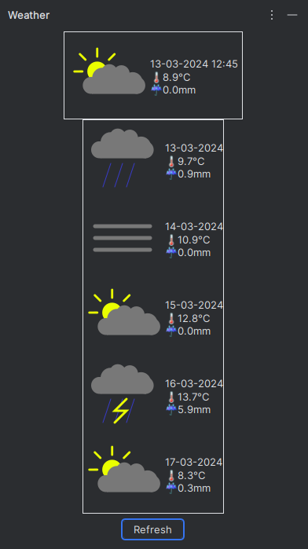

# WeatherlliJ

Weather plugin for IntelliJ IDEA IDE.  
University project!  
It is common knowledge that programmers, and especially IT students don't leave their basements more than a few times a
year.
This plugin allows them to know the weather to more easily imagine what the outside world looks like.  
Placeholder cloud icon taken from Font Awesome: https://fontawesome.com/icons/cloud?f=classic&s=solid.

This project uses free Open-Meteo weather API: https://open-meteo.com/.

## Screenshots




## Build and install

### Build

#### Linux

In your preferred terminal run:

```console
./gradlew
```

Output jar file will appear in build/libs.

#### Windows

1) Install a real operating system.
2) Go to linux section.

If you REALLY want to stay on windows, run `gradelw.bat` script.  
Output jar file will appear in build/libs.

### Install

In IntelliJ IDEA go to  
`Settings` | `Plugins` | `⚙` Cog on top bar | `🔌Install Plugin from Disk...`  
and select WeatherLLiJ-(version).jar file located in build/libs folder.

## TODO

- replace default placeholder assets (plugin icon / tool window icon)
- add settings panel to set location
- make UI look somehow presentable
- possibly add auto refreshing
- possibly add internationalization
